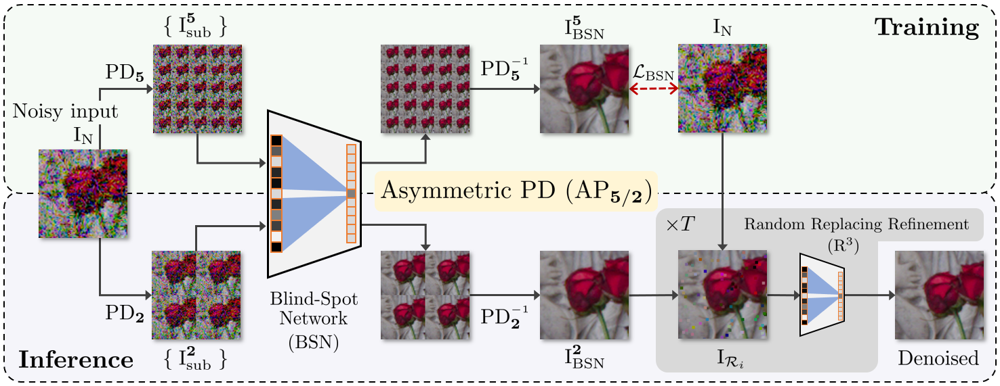

# AP-BSN: Self-Supervised Denoising for Real-World Images via Asymmetric PD and Blind-Spot Network

This is an official PyTorch implementation of ["AP-BSN: Self-Supervised Denoising for Real-World Images via Asymmetric PD and Blind-Spot Network"]() in CVPR 2022.




## Abstract
_Blind-spot network (BSN) and its variants have made significant advances in self-supervised denoising. Nevertheless, they are still bound to synthetic noisy inputs due to less practical assumptions like pixel-wise independent noise. Hence, it is challenging to deal with spatially correlated real-world noise using self-supervised BSN. Recently, pixel-shuffle downsampling (PD) has been proposed to remove the spatial correlation of real-world noise. However, it is not trivial to integrate PD and BSN directly, which prevents the fully self-supervised denoising model on real-world images. We propose an Asymmetric PD (AP) to address this issue, which introduces different PD stride factors for training and inference. We systematically demonstrate that the proposed AP can resolve inherent trade-offs caused by specific PD stride factors and make BSN applicable to practical scenarios. To this end, we develop AP-BSN, a state-of-the-art self-supervised denoising method for real-world sRGB images. We further propose random-replacing refinement, which significantly improves the performance of our AP-BSN without any additional parameters. Extensive studies demonstrate that our method outperforms the other self-supervised and even unpaired denoising methods by a large margin, without using any additional knowledge, e.g., noise level, regarding the underlying unknown noise._

---

## Setup

### Requirements

Our experiments are done with:

- Python 3.9.5
- PyTroch 1.9.0
- numpy 1.21.0
- opencv 4.5.2
- scikit-image 0.18.1

### Directory

Follow below descriptions to build code directory.

```
AP-BSN
├─ ckpt
├─ conf
├─ dataset
│  ├─ DND
│  ├─ SIDD
│  ├─ NIND
│  ├─ prep
├─ figs
├─ output
├─ src
```

- Make `dataset` folder which contains various dataset.
  - place [DND](https://noise.visinf.tu-darmstadt.de/), [SIDD](https://www.eecs.yorku.ca/~kamel/sidd/), [NIND](https://commons.wikimedia.org/wiki/Natural_Image_Noise_Dataset) datasets at here.
  - `prep` folder contains prepared data for efficient training. (croped patches with overlapping)
  - how to prepare existing or custom dataset is available at [here](./src/datahandler/prepare_dataset.md).
- Make `output` folder which contains experimental results including checkpoint, val/test images and training logs.
- Recommend to use __soft link__ due to folders would take large stroage capacity.

### Pre-trained Models

You can download pretrained checkpoints of our method. Place these files into `ckpt` folder.

| Method |      Dataset   |      Config file     | Pre-trained |
| :----: | :------------: | :------------------: | :---------: |
| AP-BSN |      SIDD      |    APBSN_SIDD.yaml   | [To be uploaded]() |
| AP-BSN | SIDD_benchmark | APBSN_SIDDbench.yaml | [To be uploaded]() |
| AP-BSN |       DND      |     APBSN_DND.yaml   | [To be uploaded]() |
| AP-BSN |      NIND      |    APBSN_NIND.yaml   | [To be uploaded]() |


## Quick start

### Training

```
usage: python train.py [-c CONFIG_FILE_NAME] [-g GPU_NUM] 
                       [-s SESSION_NAME] [-r] [--thread THREAD_NUM]

Train model.

Arguments:      
  -c CONFIG_FILE_NAME              Configuration file name. (only file name in ./conf, w/o '.yaml') 
  -g GPU_NUM                       GPU ID(number). Only support single gpu setting.
  -s SESSION_NAME      (optional)  Name of training session (default: configuration file name)
  -r                   (optional)  Flag for resume training. (On: resume, Off: starts from scratch)
  --thread THREAD_NUM  (optional)  Number of thread for dataloader. (default: 4)
```

You can control detail experimental configurations (e.g. training loss, epoch, batch_size, etc.) in each of config file.

Examples:

```
# Train AP-BSN for the SIDD dataset using gpu:0
python train.py -c APBSN_SIDD -g 0

# Train AP-BSN for the DND dataset wtih session name "MyAPBSN_DND" using gpu:0 and keep training (resume)
python train.py -c APBSN_DND -g 0 -s MyAPBSN_DND -r
```

### Test

```
usage: python test.py [-c CONFIG_FILE_NAME] [-g GPU_NUM] 
(model select)        [-e CKPT_EPOCH] [--pretrained MODEL] 
                      [-s SESSION_NAME] [--thread THREAD_NUM] [--test_img IMAGE]

Test dataset or a image using pre-trained model.

Arguments:      
  -c CONFIG_FILE_NAME              Configuration file name. (only file name in ./conf, w/o '.yaml') 
  -g GPU_NUM                       GPU ID(number). Only support single gpu setting.
  -e CKPT_EPOCH                    Epoch number of checkpoint. (disabled when --pretrained is on)
  --pretrained MODEL   (optional)  Explicit directory of pre-trained model in ckpt folder.
  -s SESSION_NAME      (optional)  Name of training session (default: configuration file name)
  --thread THREAD_NUM  (optional)  Number of thread for dataloader. (default: 4)
  --test_img IMAGE     (optional)  Image directory to denoise a single image. (default: test dataset in config file)
```

You can also control detail test configurations (e.g. on/off R^3, test dataset, etc.) in each of config file.

Examples:

```
# Test SIDD dataset for 20 epoch model in gpu:0
python test.py -c APBSN_SIDD -g 0 -e 20

# Test SIDD dataset for pre-trained model (./ckpt/AP-BSN_SIDD.pth) in gpu:0
python test.py -c APBSN_SIDD -g 0 --pretrained AP-BSN_SIDD.pth

# Test a image (./sample.png) with pre-trained SIDD AP-BSN in gpu:0 (saved as ./sample_DN.png)
python test.py -c APBSN_SIDD -g 0 --pretrained AP-BSN_SIDD.pth --test_img sample_image.png
```

## Results

Here is reported results of AP-BSN. Please refer our paper for more detailed results.


## Reference

```
To be uploaded
```